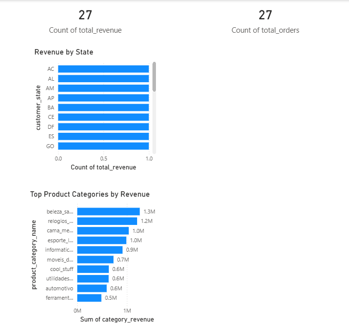

# E-Commerce Data Analytics Portfolio

This project analyzes the Olist Brazilian e-commerce dataset using SQL and Power BI.

## Tools Used
- PostgreSQL
- SQL
- Power BI
- GitHub

## Power BI Dashboard

This dashboard shows revenue distribution by Brazilian state and product category.

## Key Insights

- São Paulo (SP) generates the highest revenue.
- Health & Beauty and Watches are among the top-performing categories.
- Revenue is concentrated in a few high-performing states.

## Project Structure
