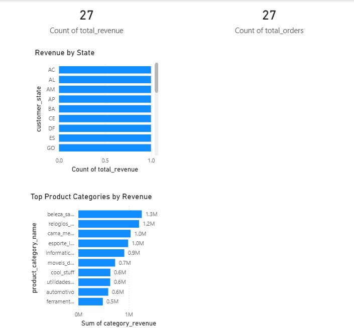

# E-Commerce Data Analytics Portfolio

## 📌 Project Overview
This project analyzes the Brazilian Olist e-commerce dataset to understand customer behavior, revenue patterns, and operational efficiency.

## 🎯 Objectives
- Analyze order funnel and identify drop-offs
- Understand customer retention and repeat behavior
- Identify high-value customers and revenue drivers
- Build dashboards for business decision-making

## 🛠️ Tools Used
- SQL (PostgreSQL)
- Python (pandas, matplotlib)
- Power BI
- Excel

## 💼 Business Problem

The e-commerce business shows strong revenue generation but suffers from:
- High revenue concentration among a small group of customers
- Low customer retention, with a majority of users making only one purchase

This project analyzes customer behavior, revenue distribution, and order patterns to identify growth opportunities and improve retention.

## 📊 Key Insights
- Revenue distribution is highly right-skewed, with a small percentage of customers contributing a large share of total revenue
- Approximately 80% of customers are one-time buyers, indicating low retention
- Customer base shows weak repeat purchase behavior, highlighting reliance on new customer acquisition
- São Paulo contributes the highest share of total revenue, indicating geographic concentration
- Order fulfillment is efficient with a high delivery success rate (~97%)

## ❓ Key Questions Answered
- Where is revenue concentrated?
- What percentage of customers drive most revenue?
- How strong is customer retention?
- Which regions contribute the most to revenue?
- Where are the biggest drop-offs in the order lifecycle?

## 📁 Project Structure
- `sql/` → All SQL queries (fundamentals → advanced → analytics)
- `python/` → Data cleaning & analysis notebooks
- `power_bi/` → Dashboard files
- `case_studies/` → Business insights & analysis reports

## 📈 Dashboard Preview

## 🚀 Business Impact
This analysis enables:
- Identification of high-value customers for targeted retention strategies
- Detection of revenue concentration risks
- Insights into customer churn and repeat purchase behavior
- Regional optimization based on revenue contribution
- Identification of opportunities to improve customer lifecycle engagement
## The business faces two key challenges:
- Revenue is concentrated among a small group of customers
- Majority of customers do not return after their first purchase

This project investigates the root causes and identifies strategies to improve retention and revenue stability.

## 📌 Recommendations

- Target mid-frequency customers (2–4 orders) with personalized offers to increase retention
- Introduce loyalty programs to encourage repeat purchases
- Reduce dependency on top customers by improving engagement across broader segments
- Implement post-purchase engagement strategies (email, discounts, re-targeting)
- Focus on high-performing regions while improving underperforming markets